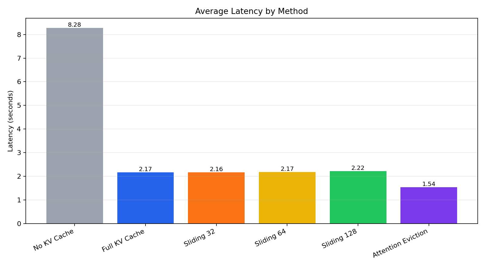
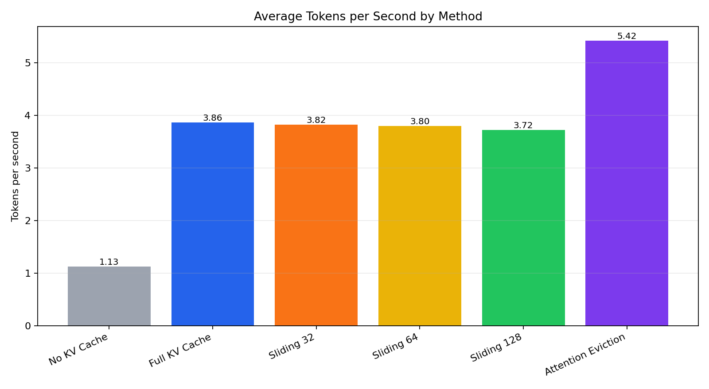
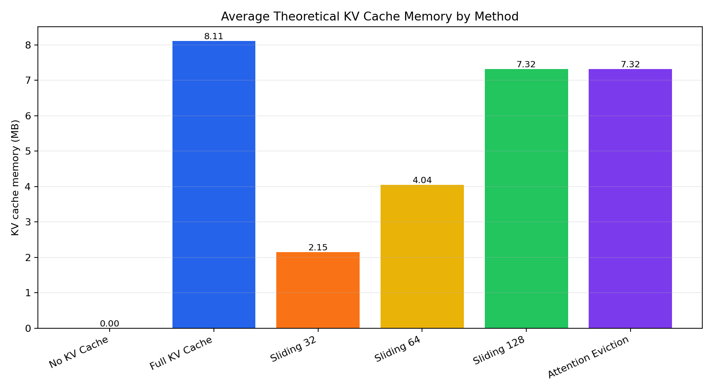
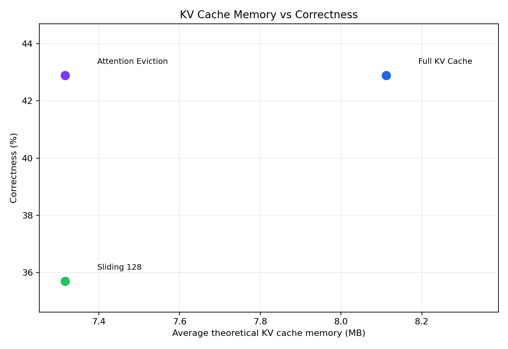

# Adaptive KV Cache Optimization for GPT-2 Inference

This project benchmarks KV cache strategies for GPT-2 inference. It compares speed, memory tradeoffs, and answer correctness across standard and adaptive cache methods.

## What This Project Tests

The project compares:

- `no_kv_cache`: recomputes the full sequence at every generation step
- `full_kv_cache`: stores all previous K,V tensors
- `sliding_window_32`, `sliding_window_64`, `sliding_window_128`: keeps only the most recent cached tokens
- `attention_recent64_top64`: keeps the latest 64 tokens plus 64 older tokens selected by accumulated attention

## Why KV Cache

GPT-2 is an autoregressive decoder model. It generates one token at a time. Without KV cache, old tokens are recomputed again and again.

With KV cache, the model stores previous Key and Value tensors and reuses them:

```text
No cache:
process prompt + generated tokens again every step

Full KV cache:
process only the newest token and reuse old K,V tensors
```

Full KV cache should not change the answer because it reuses the same K,V tensors that would otherwise be recomputed. It changes efficiency, not model behavior.

## Metrics

The benchmark uses these main metrics:

- `latency_s`: total generation time
- `tokens_per_second`: generation speed
- `memory_delta_mb`: observed process memory change
- `theoretical_kv_cache_mb`: estimated memory used by K,V tensors only
- `correct`: whether the generated output contains the expected keyword

`memory_delta_mb` is approximate because it includes Python, PyTorch, temporary tensors, and memory allocator behavior. `theoretical_kv_cache_mb` is the cleaner KV-cache-specific estimate.

## Dataset

The benchmark dataset is:

```text
data/benchmark_prompts.jsonl
```

Each line is one JSON object.

### Dataset Fields

- `id`: unique prompt identifier
- `category`: benchmark type
- `prompt`: text sent to the model
- `expected_keyword`: keyword that should appear in the output, or `null` for open-ended prompts
- `prompt_tokens_gpt2`: exact prompt token count using the GPT-2 tokenizer
- `description`: what the prompt is testing

### Dataset Categories

- `normal_generation`: short prompts for basic speed comparison
- `old_recall`: important information appears near the beginning
- `recent_recall`: important information appears near the end
- `instruction_retention`: instruction appears near the beginning
- `long_context`: longer open-ended prompts
- `multi_fact_recall`: several facts appear in the prompt, then one is queried

### Scoring

For prompts with `expected_keyword`, correctness is:

```text
correct = expected_keyword appears in generated output
```

For prompts where `expected_keyword` is `null`, correctness is not automatically evaluated. Those prompts are used mainly for latency, memory, tokens per second, and qualitative output comparison.

Token counts are tokenizer-specific. This project uses `prompt_tokens_gpt2` because the benchmark model is GPT-2.

## How To Run

Install dependencies:

```bash
pip install -r requirements.txt
```

Run the basic KV cache benchmark:

```bash
python3 src/benchmark_gpt2_kv_cache.py --max-new-tokens 8
```

Run the attention-eviction benchmark:

```bash
python3 src/benchmark_attention_eviction.py --max-new-tokens 8
```

Analyze a result file:

```bash
python3 src/analyze_results.py \
  --input results/gpt2_attention_eviction_results.csv \
  --output results/gpt2_attention_eviction_summary.csv
```

Generate plots:

```bash
python3 src/plot_results.py
```

## Results Files

Raw and summary outputs are stored in:

```text
results/gpt2_kv_cache_results.csv
results/gpt2_kv_cache_summary.csv
results/gpt2_attention_eviction_results.csv
results/gpt2_attention_eviction_summary.csv
```

Plots are stored in:

```text
plots/latency_by_method.png
plots/tokens_per_second_by_method.png
plots/kv_cache_memory_by_method.png
plots/memory_vs_correctness.png
```

## Results Plots

### Average Latency by Method



### Average Tokens per Second by Method



### Average Theoretical KV Cache Memory by Method



### KV Cache Memory vs Correctness



## Current Findings

Full KV cache is much faster than no KV cache because it avoids recomputing old K,V tensors.

Sliding window cache reduces theoretical KV memory, but small windows can hurt correctness because old important tokens may be dropped.

Attention-based eviction keeps recent tokens and high-attention older tokens. In the current benchmark, `attention_recent64_top64` matched full-cache correctness while using bounded KV cache memory.

## Report

For the full explanation, including questions we faced and design reasoning, see:

```text
REPORT.md
```
